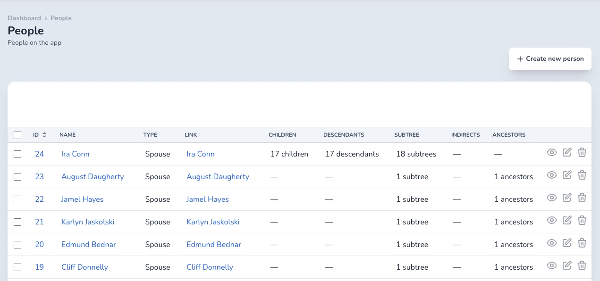
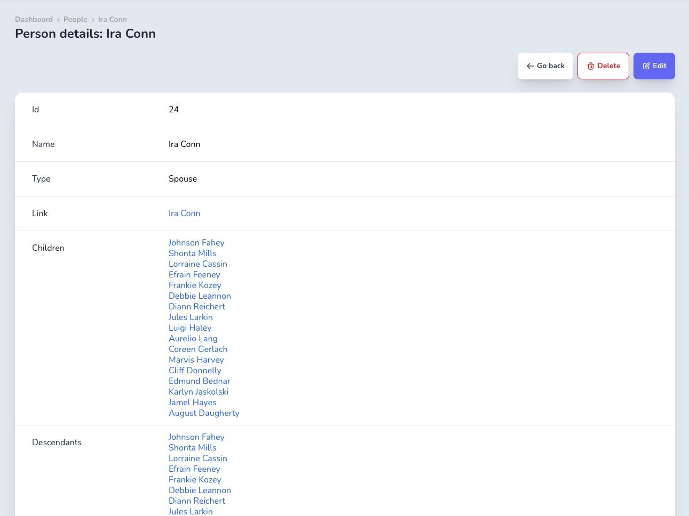
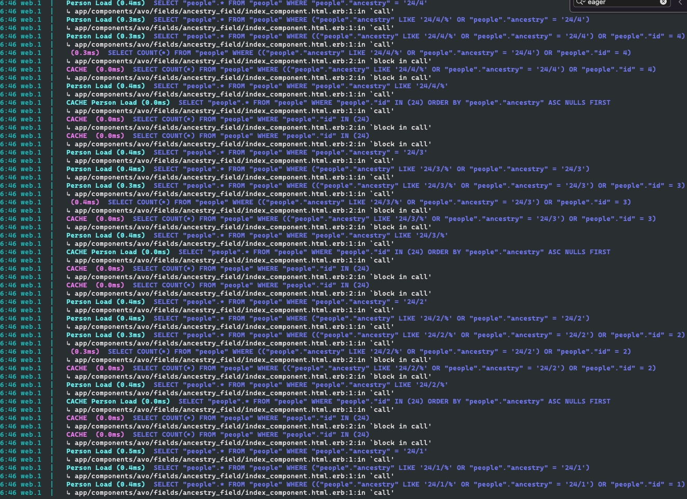

# Avo ancestry field (basic support)

This is the super-basic support for the [ancestry](https://github.com/stefankroes/ancestry) gem. There are a lot of improvements to be done here.

### Requirements

You need to have [Avo Pro](https://avohq.io/purchase/pro) installed in your app.

### Installation

Copy the files from `app` to your project.

### Usage

You can use this field like so:

```ruby
class PersonResource < Avo::BaseResource
  self.title = :name
  self.description = 'People on the app'
  self.includes = []

  field :id, as: :id
  field :name, as: :text, link_to_resource: true

  field :spouses, as: :has_many

  field :children, as: :ancestry # You can use children, descendants, subtree, indirects and ancestors like below
  # field :descendants, as: :ancestry
  # field :subtree, as: :ancestry
  # field :indirects, as: :ancestry
  # field :ancestors, as: :ancestry
end
```

This field is hidden on the `Edit` screen.

### Customization

You can further customize the index and show view partials to display the data you need. Also, you can enable the edit ecomponent by removing `hide_on :edit` from the field file.

### Screenshots




### Recommendations

I would hide it on the `Index` screen. It makes a lot of calls (screenshot below) to the DB. Not sure if the `ancestry` gem supports eager loading.


